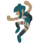

#  posepal
posepal is a Godot add-on by AniMesuro that allows storing a group of scene properties into Pose Libraries for use in 2D animation.
The project is a work in progress, so it may have bugs and it can crash Godot.

## Installation
posepal is still in development, so you can only install it from the github page.
There's no stable release yet, so either clone it or download as a zip file and paste it on `res://addons/` of your project.

## Getting Started
- On the Parameters tab, click on poselib and select the owner of a scene. A poselib resource is created, but it will only save after changes are made to it.
- Select a filter. The default one is "none", which tracks all nodes inside the edited pose root.
- Select a template. The default is "default", which has no base properties.
- Select a collection. The default is "default", which stores poses.
- Clicking on New pose, you can key properties from different nodes into an Animation so that they're stored into the pose.
- Click save. A new pose is created at the tab "Palette".
- Select an AnimationPlayer from the scene. Choose a time and click on the pose preview. It will key it on the selected animation.
[If you want to know more, there's a wiki.](https://github.com/AniMesuro/posepal/wiki)

### Recommended Practices
Key template checkbox makes so you pose exactly as in the preview.
Don't key on duplicates checkbox makes the keying more readable as it only keys on change.
Queue key is a useful button to remove the need to fix the previous keys when keying a pose.
[There's a page for more practices.](https://github.com/AniMesuro/posepal/wiki/Recommended-Practices.)

## Godette Example Rig
GodetteRig is an example scene that comes bounded to a PoseLib. She has a template for 8 directions: (Left, 3/4 Left, Front, 3/4 Right, Right, 3/4 Back Right, Back and 3/4 Back Left).
The PoseLib comes with default poses to demonstrate the add-on's basic capabilities.
Both the assets and the poselib is subject to change.
Her files are found on `res://addons/posepal/_example_rig_godette/`

## Pose Library
A Pose Library is a Resource bound to a scene that stores pose templates and collections.
Poselibs are bound to scenes by the meta variable "_plPoseLib_poseFile" in the scene root.
A poselib file will by default be saved at `res://addons/posepal/.poselibs/` and will have the ".poselib.tres" or ".poselib.res" extension.

## Poses
Poses are records of data that store the state of a scene by storing selected properties. Usually used for character animation, but most kind of properties can be saved. (Unless tests are proven otherwise)
Pose editing is done through the AnimationTimelineEditor in Godot, by keying desired properties at the current time

## Filters
Filters are a special kind of pose that do not stores values. These are used to filter only poses that change selected nodes from a filter.
Currently you need to edit it the same way as a pose, that is by the timeline. You need to key at least one property for each node you want to filter. Filter poses only store NodePaths, so the property doesn't matter.
You can either batch key selected nodes with a random variable or mass-select nodes in the scene and key some transform property from the toolbar.

## Templates
Templates are poses that are used as a base for all poses inside a collection. Therefore all poses created inside this template will copy the template's properties unless overwritten. A template can have duplicated template pose, but can't have a duplicated template name.

## Collections
Collections store poses directly. They're used to organize lots of poses.

## Pose Previews
These are thumbnail visualizations of the scene but overwritten by the pose. The generation of thumbnails is expensive because they need to instance a ghost version of the scene with only visual data (transforms, texture, z_index, etc.)

### Batch-key Pose
Keying properties for the pose is time consuming, so there is a shortcut to batch key all properties that have a track in the scene.
When you press the button on the Pose Options tab, you can select which nodes will key a written property.
The code for finding the user selected AnimationPlayer is dumb, so it's advisable to check the window title if it matches the Animation name.

## Limitations:
- posepal does not support 3D scenes, and bone animation.
- Changing the edited scene as you're editing a pose crashes Godot, so the Scene Tabs is invisible as you do so.
- Changing nodes names and nodepaths may make the poselib unusable.
- Changing resources (Images)'s paths will confuse the poselib. The poselib will still be
usable, but you'll need to fix the dependencies.

The add-on is not very stable, so it's advisable not use in production.
Making backups is always advisable, but you'd need to copy the files manually.

## Support:
If you like this project, I'd greatly appreciate a donation. 

